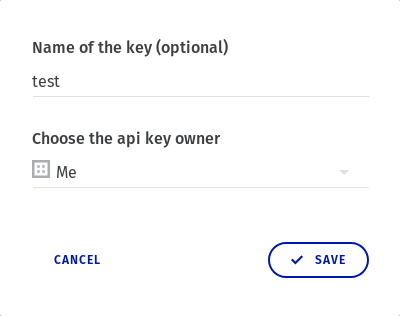
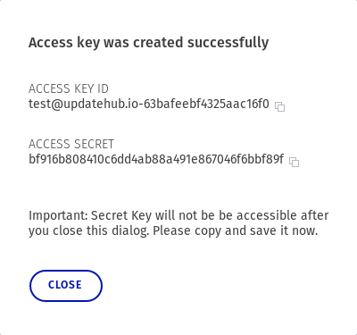
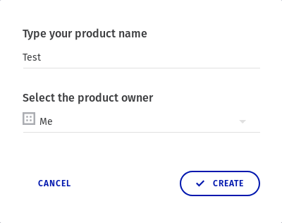
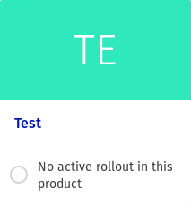
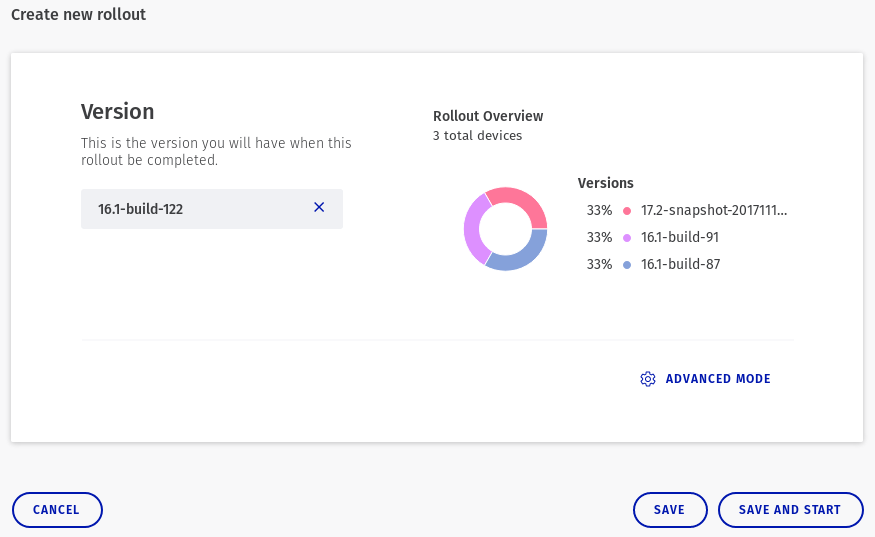
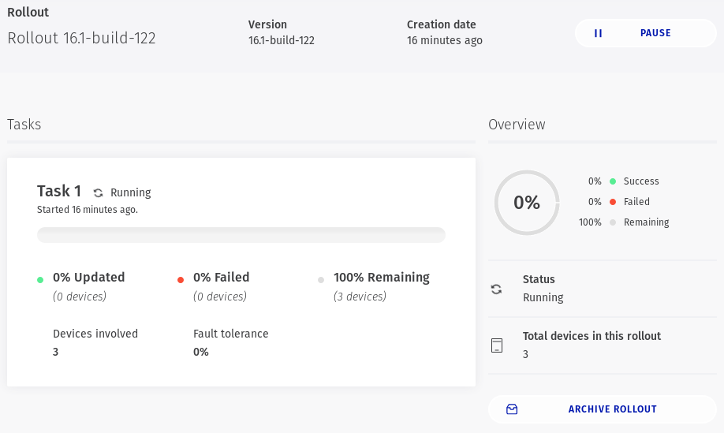

# Quick Start

On this section we show how to create a new build that is ready for
**updatehub**. We will base the quick start build on a Yocto-supported machine,
and explain every step needed to build, push and deploy a new update. By the end
of it you should have an understanding of the entire process of creating and
applying an update of devices on **updatehub**.

Before we begin, it’s important to have a background on the terms used in this
document:

- **update**: a piece of compiled software intended to replace another while
  adding features and/or bug fixes.
- **device**: a physical computing machine running a software that can be
  updated.  machine: a type of computing machine that has specifications and
  requirements for running a piece of software. A software compiled for one
  machine cannot run, or at least won’t fully support, another machine.
- **rollout**: the act of updating the software on a set of devices of a machine
  type from one specific version to another.
- **management server**: a **updatehub** service that manages and provides
  updates for devices.
- **agent**: the program running on a device that is responsible for pooling for
  new available updates of the current version of software, and in case of
  finding one perform it.

For the sake of specificity we will use the Raspberry Pi as the machine for this
quick start. To check other machines supported by **updatehub** please check this.

# Dependencies

Including **updatehub** to your project should be fairly simple, as it doesn't
require any special dependencies on the build system. Simply include the
meta-updatehub layer and the BSP support layer to your build and it will be
ready to generate a new image with the system.

# Generate key pair for UHU package signing

This is needed to validate the generated update package. Each device will contain
the public key which will validate any received package before uncompressing it
and applying an update.

```
user@dev$ mkdir -p /home/user/.updatehub/keys
user@dev$ openssl genpkey -algorithm RSA -out /home/user/.updatehub/keys/private_key.pem -pkeyopt rsa_keygen_bits:4096
user@dev$ openssl rsa -pubout -in /home/user/.updatehub/keys/private_key.pem -out /home/user/.updatehub/keys/public_key.pem
```

!!! warning
    Keep in mind that once an update has been generated and applied with a key
    it will not validate any packages with another key, so *keeping any
    generated keys safe **MUST** be a top priority for your organization*.

# Management server access

This section will show how to access the management server and retrieve the
credentials for working with updates on your Yocto project build. Your
credentials are valid for any project you can manage, so this section steps
should be done only once, or in case the credentials are lost.

The first thing you should do is to sign up for **updatehub** early access. Go
to [updatehub.io](https://updatehub.io), fill up and send the form. As of the
time of the writing of this document the approval of new sign up requests is
gradual as we add new features, expand and test the platform to accommodate new
users.

After signup you should receive a confirmation email to verify your email
shortly. After confirmation you can access
[dashboard.updatehub.io](https://dashboard.updatehub.io) to login to the web
interface, and manage your product updates.

First, you need to generate an API access ID and key. Click on your email on the
top left of the web interface and select "Settings" on the dropdown menu. You
will be directed to the user settings page. On the "Application access" area
click on the "Request Access Key" button. Fill in the key name and choose the
API key owner as "Me", then click on Save.



The next modal windows will show you your newly created access ID and access
key:



!!! warning
    Please keep in mind that **THIS IS THE ONLY TIME THE ACCESS KEY WILL EVER BE
    AVAILABLE TO YOU!** After closing the window the access key cannot be
    retrieved again, so be sure to copy and save it on a reliable medium!

With those credentials the **updatehub** Yocto layers will have the necessary
information to access the management server API and push new updates.

# Project setup with updatehub

First, add the ID and secret to you project `build/conf/local.conf`. Using the values
retrieved from the previous section:

```
UPDATEHUB_ACCESS_ID = "test@updatehub.io-63bafeebf4325aac16f0"
UPDATEHUB_ACCESS_SECRET = "bf916b808410c6dd4ab88a491e867046f6bbf89f"
```

And then include the key pair files path generated before also to
`build/conf/local.conf`:

```
UPDATEHUB_UHUPKG_PUBLIC_KEY = "/home/user/.updatehub/keys/public_key.pem"
UPDATEHUB_UHUPKG_PRIVATE_KEY = "/home/user/.updatehub/keys/private_key.pem"
```

## Product creation at the management server

On the main page click on the "Add product" button, and type in "Test" in the
"Type your product name" field and select "Me" at the "Select the product owner"
selection control:



Click on "Create" and the new product should appear on the dashboard.



Clicking on it should take you to the product page. At the bottom of the page a
Product UID will be displayed.


Copy the UID and edit your `build/conf/local.conf` to set the variable
`UPDATEHUB_PRODUCT_UID` with it:

```
UPDATEHUB_PRODUCT_UID = "05344b71c3e9f89c799f775a213b013932bc962b89ae8a29af66b51b099cdbeb"
```

## Integrating updatehub Yocto Project layers to your build

Including the **updatehub** Yocto layers to your build is easy: first clone the
meta-updatehub layer and the machine support layer to your sources directory:

```
user@dev:~$ cd project/sources
user@dev:~/project/sources$ git clone https://github.com/updatehub/meta-updatehub
user@dev:~/project/sources$ git clone https://github.com/updatehub/meta-updatehub-raspberrypi
```

Now add the two layers to your `build/conf/bblayers.conf` file:

```
user@dev:~/project/sources$ bitbake-layers add-layer sources/meta-updatehub
user@dev:~/project/sources$ bitbake-layers add-layer meta-updatehub-raspberrypi
```

With that the layers should be integrated with your build. Keep developing your
solution as you normally would. After the build more steps are necessary to push
your changes to the management server.

## Create and push a new package to the updatehub server

When a new build with changes has successfully finished another commands must be
run to push the changes to the updatehub management server.

```
user@dev:~/project/sources$ bitbake core-image-base -c uhupush
```

After that is done the update should appear in the management server web
interface.

## Creating and starting a new rollout

With a new packaged build version pushed to the management server a new rollout
can be created based on this new version. Go to the product page no the
management server and click the button "Create Rollout".

The management server may already have registered some devices depending on how
long you created the product entry. On the example below there is exactly 3
devices, each with it’s own version, which will all update to the version
specified:



The "Version" field should show the available packages pushed to the management
server. Select it and click "Save and Start". The rollout should be created and
started immediately:



With this the rollout will have started, and any new request for update will
progress the rollout.
