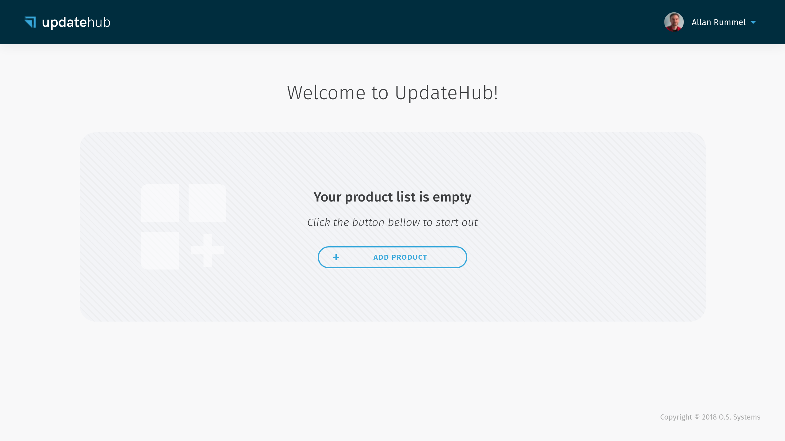
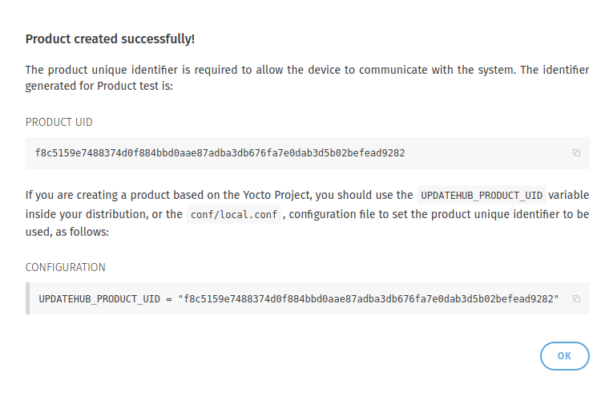

# Quick starting with RaspberryPi 3

In this step-by-step we show how easily you can generate a **Linux** image,
that has **UpdateHub** support, using **Yocto Project** in a **Raspberry Pi 3**
development board. So you can get to know **UpdateHub** in a practical way and
see how simple it is to keep your devices updated in the field using a secure
way of communication.

!!! warning ""

    We assume that you have previous experience with the Yocto
    Project, know the main terms and have already created an image using it. If
    you are new to this
    [tutorial](https://www.yoctoproject.org/docs/3.0.1/brief-yoctoprojectqs/brief-yoctoprojectqs.html),
    you can use it.

## What You Will Need

To follow this guide, you will need the following:

* A **Raspberry Pi 3** [Model
B](https://www.raspberrypi.org/products/raspberry-pi-3-model-b/) or
[B+](http://www.raspberrypi.org/products/raspberry-pi-3-model-b-plus/)
* An 4 GB or larger micro SD card
* An Ethernet cable for wired connectivity to the internet
* An [UpdateHub account](https://auth.updatehub.io/auth/signup/) to access the
hosted server

!!! info ""

    An **UpdateHub** account allows manager even 5 devices; for more
	support and features is advisable [migrate your
	plan](https://updatehub.io/pricing/#pricing).

## Step guide

In order to generate an image that connects a device to the **UpdateHub
Cloud**, we will first have to [prepare the **Yocto Project**
environment](#first-step-preparing-the-yocto-project-environment) with the
basic layers to generate an image with support for UpdateHub.

In addition to the layers, you will need to configure some variables that are
generated on the Dashboard. The first is the [product
identifier](#second-step-creating-a-product) to which the device and the image
will be connected. Then we will have to [generate an access
key](#third-step-generating-an-access-key) in *Settings* that will authenticate
the device when it accesses the server.

At this point, we [check the
*local.conf*](#fourth-step-configuring-the-localconf-file) file to verify that
everything is correct and [build the
image](#fifth-step-building-an-image). That's it! Now just flash the image on
the device and it is prepared with OTA support.

Additionally we [update the image](#sixth-step-changing-the-image) by adding
ssh support and we [send the updated
image](#seventh-step-sending-a-new-image-version) to UpdateHub Cloud and show
how simple an update of your device is with the [create a
rollout](#eighth-step-creating-a-rollout).

## First step: preparing the Yocto Project environment

The first step is to initialize the environment to build a **Linux** image
using **Yocto Project** and for that we need to fetch all the needed layers,
that includes the main *OE-Core* layers, the *BSP* layer that adds support to
**Raspberry Pi** and the layers that add support to **UpdateHub**.

To get the platform you need to have
[*Repo*](https://gerrit.googlesource.com/git-repo/) \(a tool for manager git
repositories\) installed:

For *Debian/Ubuntu* based distros run:

```
sudo apt-get install repo
```

For others distros, check the distro documentation or install `repo` manually:

```
mkdir -p ~/.bin
PATH="${HOME}/.bin:${PATH}"
curl https://storage.googleapis.com/git-repo-downloads/repo > ~/.bin/repo
chmod a+rx ~/.bin/repo
```

To download the platform source, that will download all layers:

```
mkdir updatehub-get-started
cd updatehub-get-started
repo init -u https://github.com/fbertux/updatehub-yocto-project-get-started.git
repo sync
```

Setup the environment with:

```
source ./setup-environment build
```

At the end of the commands you have all metadata you need to start to work.

## Second step: creating a product

One of the variables needed to generate the image is the product identifier
that is generated when creating a *Product*.

To create a *Product* just go to [*Dashboard*](https://dashboard.updatehub.io/)
and click on *Add product*.

<p align="center"> 
  </p>

By doing that the following dialog will be displayed. You should choose a
*Product* name and in *Owner* choose *Me*.

!!! danger "About the name and owner"

    Bear in the mind that after you create a
    *Product* you can not renamed or deleted it, and you can not transfer it to
    a organization or vice versa, so have sure you are choosing the correct
    name and the owner.

<p align="center"> 
  </p>

After the *Product* has been created a *Unique Identifier Number*
\(*UPDATEHUB_PRODUCT_UID*\) is generated to identify it. This number, should be
added to your build in order to allow the **UpdateHub** agent, which runs
inside the target device, to communicate with the **UpdateHub Cloud**.

<p align="center">  </p>

For convenience, you can add the *UPDATEHUB_PRODUCT_UID* to your
`build/conf/local.conf` configuration file when prototyping. However, as this
is a information that will be permanent for the whole product life cycle, it
should be put inside your distribution configuration file, or image recipe.

!!! info ""

    In case you didn't copy the *Product Unique Identifier Number* in
    the moment that you create it on the **UpdateHub Cloud** don't worry. To
    get access to this information again you must click on the *Product* icon
    and the *Unique Identifier Number* will be shown to you.

Once you have logged in, the *Products* page will display the list of your own
products and the other products you have access to.

<p align="center"> 
  </p>

## Third step: generating an Access Key

To authenticate and authorize requests for a project build with the **UpdateHub
Cloud** you must have a security credential in the form of an application
access key. Each access key is specific to your user and is used to upload the
packages update or any other external integration which needs to access the
**UpdateHub** API.

In order to generate an *Access Key* you must enter the *Settings* menu and
click on the *+ Request Access Key* button. Choose a name for the key and
select the API Key owner as *Me*.

<p align="center"> 
  </p>

Once the *Access Key* is created a dialog will appear to show the security
credentials.

!!! danger "Save your keys"

    On the moment that this window is closed the keys
    will not be shown again and if you lose them you must revoke the *Access
    Key* and generate a new one.

<p align="center"> 
  </p>

Include these variables in `build/conf/local.conf`:

```
UPDATEHUB_ACCESS_ID = "your-email@gmail.com-8bc21121049af..."
UPDATEHUB_ACCESS_SECRET = "9b1fcee96795fa5dea5cd04cb1d2..."
```

## Fourth step: Configuring the local.conf file

Come back in **Yocto Project** directory in your computer. After fetching the
bitbake layers is important to change some variables in the `local.conf` file.

Here we'll put the variables that were generated before: UPDATEHUB_PRODUCT_UID
from the *Product* and the UPDATEHUB_ACCESS_ID and UPDATEHUB_ACCESS_SECRET
generated in *Settings*.

```
UPDATEHUB_PRODUCT_UID = "05344b71c3e9f8..."
UPDATEHUB_ACCESS_ID = "your-email@gmail.com-8bc21121049af..."
UPDATEHUB_ACCESS_SECRET = "9b1fcee96795fa5dea5cd04cb1d2..."
```

*UPDATEHUB_PACKAGE_VERSION_SUFFIX* is used to add a suffix in the version of
the image being generated. This is useful for placing a version number and
incrementing with each new image.

```
UPDATEHUB_PACKAGE_VERSION_SUFFIX ="-test-image-1.0"
```

Finally the final of your `local.conf` file should seem like this.

```
UPDATEHUB_PRODUCT_UID = "05344b71c3e9f8..."
UPDATEHUB_ACCESS_ID = "your-email@gmail.com-8bc21121049af..."
UPDATEHUB_ACCESS_SECRET = "9b1fcee96795fa5dea5cd04cb1d2..."
UPDATEHUB_PACKAGE_VERSION_SUFFIX = "-test-image-1.0"
```

## Fifth step: building an image

With all variables configured, now we can generate our image: Open a terminal,
go to your build directory and type:

```
bitbake updatehub-image-base
```

!!! info "The generate image process can take a good time, it is dependent directly of the host resources."

Now it's time to flash the image in the SD card. Then in a terminal go to this
directory:

```
build/tmp/deploy/images/raspberrypi3/
```

and type this:

!!! danger "Check the name of the SD card before executing the command below!"

!!! tip "You can check the device name that correspond to SD card using command `dmesg`"

```
zcat updatehub-image-base-raspberrypi3.wic.gz | sudo dd of=/dev/sdX
```

With the SD card ready, you can insert it into the target and connect it to
**RaspberryPi**. The image is configured to obtain an IP address using DHCP. To
access the console, the *user* is set to root” and doesn't need to enter a
password, just hit *Enter*.

You can confirm the version of the image that is running on the target with the
command:

```
cat /etc/os-release
```

You will see the version that you put in the `local.conf` file.

```
O.S. Systems Embedded Linux 19.10 raspberrypi3 ttyS0
root@raspberrypi3:~# cat /etc/os-release
ID="oel"
NAME="O.S. Systems Embedded Linux"
VERSION="19.10"
VERSION_ID="19.10-test-image-1.0"
PRETTY_NAME="O.S. Systems Embedded Linux 19.10"
UPDATEHUB_PRODUCT_UID="05344b71c3e9f8...""
root@raspberrypi3:~#
```

## Sixth step: changing the image

Now that the whole upgrade process has been explained, we'll add support for an
SSH server on the target and create an update package to install this
functionality.

To add support for the SSH OpenSSH server add the following line to the
`conf/local.conf` file:

```
IMAGE_FEATURES += "ssh-server-openssh"
```

And change the variable *UPDATEHUB_PACKAGE_VERSION_SUFFIX* to use version of our
test image:

```
UPDATEHUB_PACKAGE_VERSION_SUFFIX = "-test-image-2.0"
```

## Seventh step: sending a new image version

We can save the file, generate a new update package, and send the new file to
**UpdateHub Cloud** by running the same command:

```
bitbake updatehub-image-base -c uhupush
```

After sending, the package will be available on the *Dashboard* in the
*Package* section of the corresponding *Product* page.

## Eighth step: creating a rollout

Rollout is the process of sending an updated image to devices in the field
through **UpdateHub Cloud**. To create a rollout we have to access the
[*dashboard*](https://dashboard.updatehub.io/), access the *Product* card we
created before, and then click on *Create rollout*. In the displayed window
choose the available version and click on *Save and start*.

The status of the update process is shown in the displayed window, and can also
be followed by the *Devices* section for each device individually.

When the status shows updated, we can access the target using the SSH protocol,
for this type in the host:

```
ssh root@TARGET_IP_ADDR
```

No password is required, just hit *Enter* and we will be in the target
console. Again we can check the version with the contents of the
`/etc/os-release` file.

**Here we finish our quick start, but we invite you to learn more about
UpdateHub in the rest of the documentation.**

If you have encountered difficulties or have any questions or suggestions,
please contact us through the Gitter or send us an email by
contact@updatehub.io.
