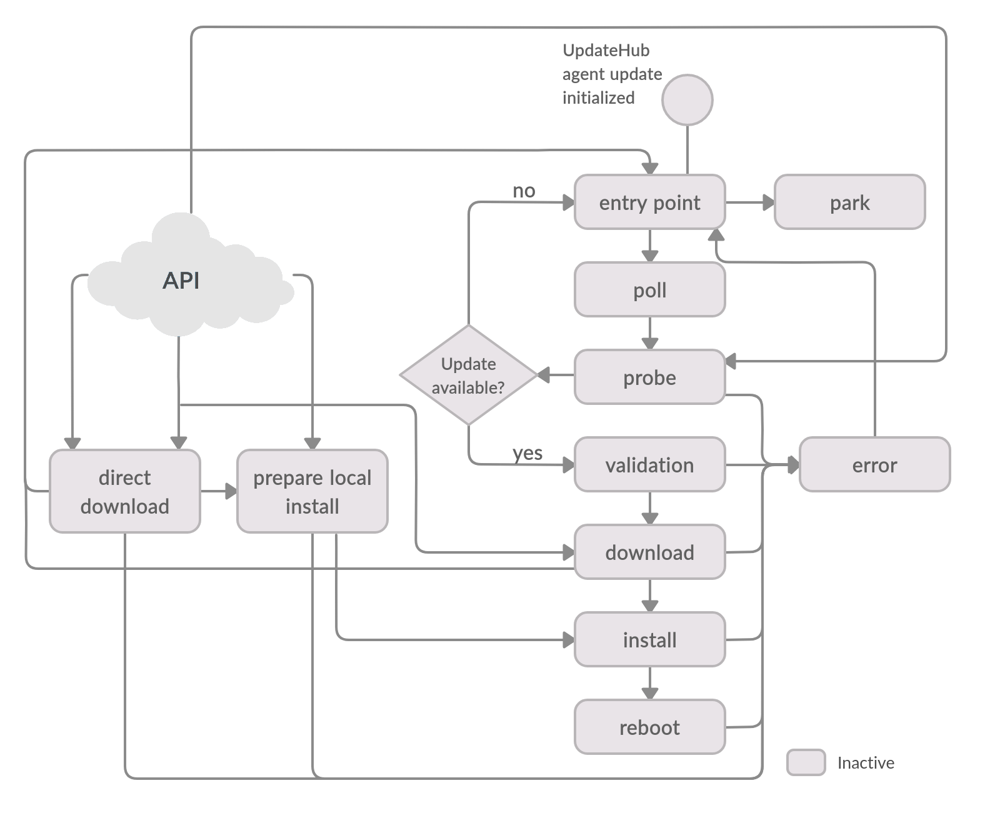
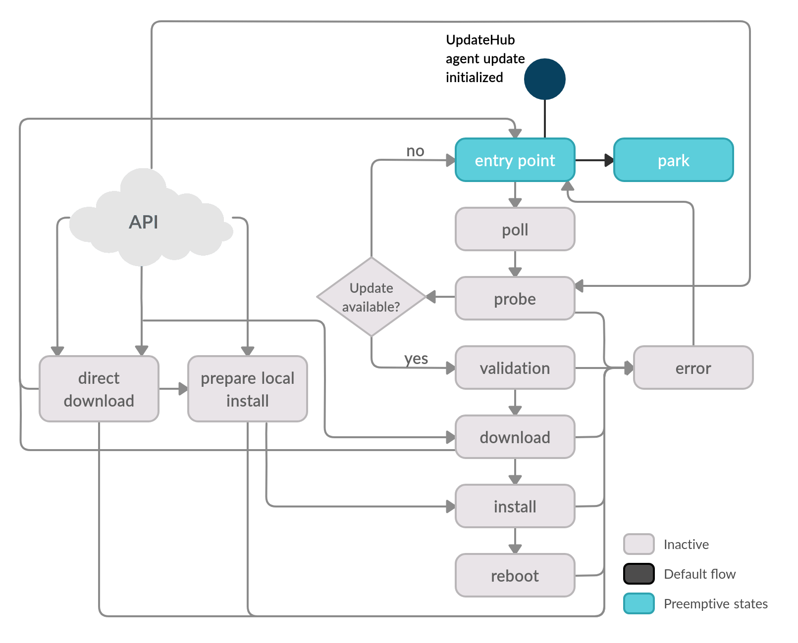
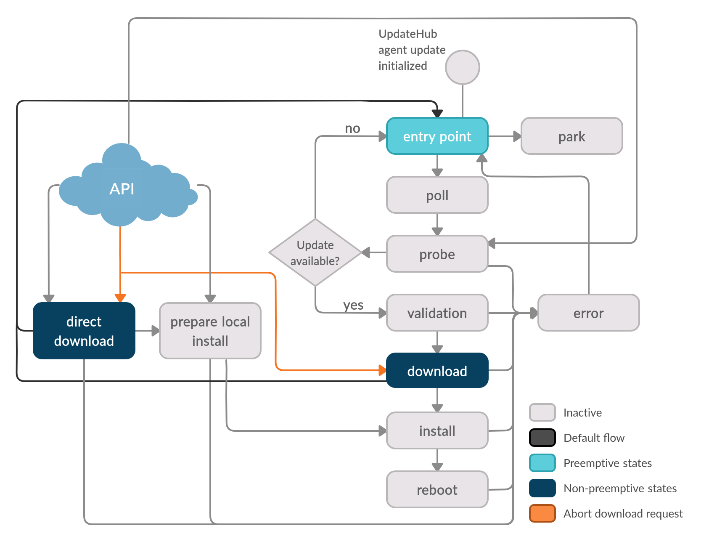

This session describes in detail the states in the **UpdateHub Agent** and the activities ran by them. However, we are tipping you to read the **UpdateHub Agent** flows before because this clarifies the role of each state in the agent’s execution.

The clarify the agente execution, we detail the flows with diagrams. We highlight the states and transitions used in each flow, while states and transitions left in gray are unused for that execution flow.

The state machine of the **UpdateHub Agent** has two state's type. Those are:

**Preemptive states**: they can handle the external requests from the API.

**Non-preemptive states**: when they receive the external request, they respond that the agent is busy and keep the original flow running uninterrupted.

<p align="center">
  
</p>

The states below are part of the default flow, and external API requests can also trigger some. For more details about the **UpdateHub Agent** flow, see here.

**entry point** - is the starting point of the state machine. It goes to the *Poll state* if the automatic probing support is enabled or to the *Park state* if there is nothing to do.

**park** - the agent stays in this state if the automatic probing support is disabled until it receives external requests.

**poll** - the *Poll state* moves the state machine to the *Probe state*, informing if it must process it immediately or wait for the required probe interval to the next probe request.

**probe** - the *Probe state* checks for an update package in the server, and when there is one available, collects the required metadata to move to the *Validation state*. In case there is no update available, the machine moves to the *Entry Point state*.

**validation** - the metadata authenticity and correctness validations must pass so the update packages requirements can be validated before download any update package data.

**download** - all update package objects are downloaded, reusing previously downloaded objects if possible.

**install** - every update package object is installed accordingly to its specific mode of it. The last action is to swap the activated installation set, making the just installed update ready to be used.

**reboot** - restarts the device.

**error** - in case of a mistake, the state machine is moved to the *Error state*. It registers the log of the process and cleanups and moves the state machine back to the *Entry point state*.


The API can trigger requests to two specific states: *Prepare local install state* and the *Direct download state*. Those are described below:

**direct download** - the *Direct download state* fetches the remote update package (uhupkg) from a custom server and make it available for the *Prepare local install state*.

**prepare local install** - the uncompression, validation, and correctness checks must pass before moving the state machine to the *Install state* to proceed with the installation of it.

The **UpdateHub Agent** uses a well-defined state machine, and the description of this machine is the best way to understand the update’s process and how to interact with the agent’s default flow.

Here we present the steps performed in the state machine and the summary of executed activities for each of them.

An essential aspect of the state machine in use is that every activity is recycled between the states, adding more efficiency. The flow of the **Direct Download request** and the **Local Install request** as interesting to explore this as the activities are practically the same. The unique difference is that in the **Direct Download request**, the agents download the external update’s data, while in the **Local Install request**, the update’s data is in the local storage. The other activities are the same between the requests.


## Default behavior

The **UpdateHub Agent** has two operation modes: it can automatically search for new updates on a pre-setted interval. It can also work in an idle mode where searching or installing an update is only triggered by an external interaction. These two different workflows are triggered by the configuration file that the agent reads upon starting.

The other workflows are triggered by requests from an external HTTP API that the agent will be listening to, coming from the CLI application, or another program that wants to interact with the **UpdateHub Agent**.


### Automatic search


The primary usage of the **Updatehub Agent** is to check for updates in the **UpdateHub Cloud** server automatically. In this workflow, the agent can work without any interaction from the external API.

When the **UpdateHub Agent** is started, it goes to the *Entry point state*. This state verifies the settings of the machine for the next transition state. The next stage is the *Poll state*, where the agent calculates how much time it should wait until checking with the server if there’s an update available. The machine then goes to the *Probe state* and awaits the appropriate time before checking for new updates on the server.

When it is time to access the server to check for an update, the *Probe state* is activated, and it accesses the  **UpdateHub Cloud** and searches for some new update’s data. If no update is available, the machine goes back to the *Entry point state*.

When an update is available on the server, the *Validation state* is activated and checks the authenticity of the update’s data. The *Validation state* also verifies whether the device has the necessary storage space for the update process. Following that, the *Download state* then downloads all the required data, checking the integrity of the packages, and the *Install state* installs the data on the proper partition of the device’s storage. By the end of the installation, the device is rebooted.

After rebooting, the agent begins at the *Entry point state* again and restarts a new cycle.

In case of an error in *Probe*, *Valitation*, *Download*, *Install*, or *Reboot*, the *Error state* is triggered. The *Error state* allows the user to use the callback to handle situations. For more information about it, see in the Callback session.


### No automatic search



When the automatic search is disabled, the **UpdateHub Agent** behaves passively, relying on external requests to inquire for new updates. This mode is useful when the user wants to control the exact time of updates according to his needs and spend fewer device resources, such as energy.

When a new request comes, the machine's control changes from the *Park state* to the requested state and the remainder of the process is the same as the normal state execution. The way to communicate to the **Updatehub Agent** is through the external HTTP API. The API offers a set of requests for the user to interact with the agent’s flow. We now show the execution flows for these requests.


## API requests

The API has a set of calls that allows the user to interact with the **UpdateHub Agent**, and here we’ll present them. Regarding the update process, there are the **Direct download request** and the **Local install request**. Besides them, the **Probe request** that when the control is in a preemptive state, give it back to the **Probe state**. We follow the **Abort download request** that aborts any download’s process, default, or direct. And lastly, we will show two requests that provide information about the state machine, the **Info request** and the **Log request**.


### Direct download request


In this process, the agent receives the **Direct download request**. The server of search is defined using a link to an alternative server or other location where the uhupkg (update package compatible with the **UpdateHub Agent**) is available.

Subsequently, the *Prepare local install state* performs the necessary tasks of space and resources validation, such as storage. With the completion of these activities, the *Install state* is executed, installing the essential data and deallocating resources that are no longer needed for the process. Finally, the device is restarted with the new image running the *Reboot state*.

Set the URL to the desired location:

```
{
  "url": "https://some_remote_url.domain/update.uhupkg"
}
```

So, to activate the **Direct download request** use the command:

```
http://updatehub_agent:port/remote_install
```


### Local install request


When the **UpdateHub Agent** receives the **Local install request**, the update package should already be available on local storage on the device. This can be done with a pen-drive, for example, and requires direct user interference on the device. So, the *Prepare local install state* verifies the authentication, data integrity and the space available on the device’s storage. It reserves the necessary resources for installation and calls the *Install state* to proceed with the installation. The device is then rebooted into the newly installed image.

The path of the uhupkg file is required, as shown below:

```
{
  "file": "/tmp/updatehub-image-qa-uh-qemu-x86-64.uhupkg"
}
```

Later, just type:

```
http://updatehub_agent:port/local_install
```


### Probe request


The **Probe request** can be accepted during any preemptive state and it returns the control to the *Probe state*.

The purpose of interrupt the flow and sending the state machine control from preemptive state to *Probe state* is that it is possible to start the update process, without waiting for the time for a new automatic search, or for looking for a new update when the automatic polling is disabled.

The **Probe request** can be invoked in two ways: the default, in which the search for update packages is done on the default server specified by the settings file, and custom way, specifying a different **UpdateHub** server to use during this update cycle.

After executing the update process, or verifying that it does not have an update available, the machine returns to the entry point and proceeds to the configured flow.

To invoke the **Probe request**:

```
http://updatehub_agent:port/probe
```

The command above start the **Probe request** default, to customize the local of probe, after add:

```
{
  "custom_server": "http://different-address:8080"
}
```


### Abort download request



The **Abort download request** is solicited by the user and interrupts the download’s activities, either from  *Download state* or the *Direct download state*. After interrupting the download tasks running, the machine’s control returns to the *Entry point state*.

**Abort download request** is useful when the user wants to put off an update, or correct the address of search.

The command below abort the download:

```
http://updatehub_agent:port/update/download/abort
```


## Others API requests

In addition to the requests presented above, the API also has others, among them the **Log request** and **Info request**. Both do not affect the machine’s behavior but provide the info about the state machine.


### Log request

The **Log request** provides information on the execution of the last state runned that is stored in the device’s memory.

To request the log just type:

```
http://updatehub_agent:port/log
```


### Info request

The **Info request** provides the machine’s general information.

The command below requests the agent's information:

```
http://updatehub_agent:port/info
```
