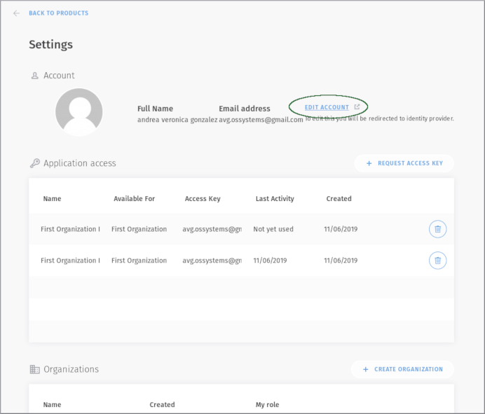
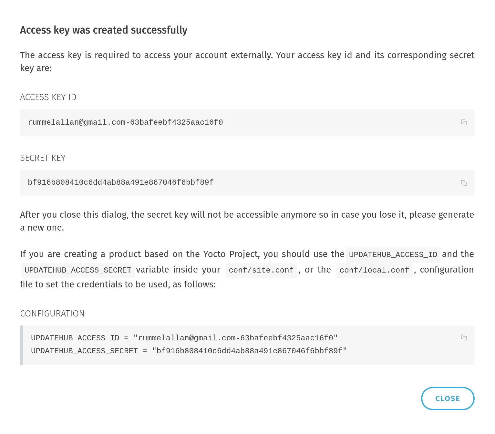

# Your menu account

In the menu we have your account information, access keys applicable to the configuration of UpdateHub on devices, *Organizations* and *Billing*.

Your account menu is at the top right of the *Dashboard*.

  

In this session we will cover:

- [Acessing settings](#acessing-settings)
- [Account personal data](#account-personal-data)
- [Applications access](#applications-access)
- [Requesting a access key](#requesting-a-access-key)
- [Organization](#organization)
- [Creating an Organization](#creating-an-organization)
- [More about the Billing](#more-about-the-billing)

## Acessing settings 

At the *Settings* menu you will find your information, and you will be able to manage your *Account*, the *Aplication Access*, as well as manage the *Organizations* you belongs to.

Sign in your account and go to settings screen by clicking on the drop down menu on the right of your name and select *Settings*.  

  

### Account personal data

The account subsection shows your current data and allows you to edit them or add a new email.

  

### Applications access 

To authenticate and authorize requests for a project build with the **UpdateHub** you must have a security credential in the form of an application access key. Each access key is specific to your user and is used to upload the packages or any other external integration which needs to access the **UpdateHub** API. 

In this section all access keys for your account will be listed.

#### Requesting a access key

If you need to, you can create a new one by clicking the *+ Request Access Key* button. Choose a name for the key and select the API Key owner as *Me* or a *Organization*.

Once the Access Key is created a dialog will appear to show the security credentials.

!!! danger "Save your keys"
    On the moment that this window is closed the keys will not be shown again and if you lose them you must revoke the Access Key and generate a new one.

  

###  Organization

In addition to the *Access Key* created for the user to work individually, the **UpdateHub** grants the possibility of more than one user to have access to the same *Product* throught of an *Organization*.

### Creating an Organization

Create an *Organization* is simple, as you just need to click on the *+ Create Organization* button and select a name for it. You will be automatically be set as *Owner*. After the creation of an *Organization* invitations for new members can be easily sent. The invite must contain the user's e-mail and the level of access allowed to him.

  

There are three users access levels inside the *Organization*, each one with a particular set of permissions:

- *Owner* - has all the permissions to normally create *Products*, start *Rollouts* and invite other members for the *Organization*.
- *Release Manager* - limited to manage the *Rollouts*.
- *Developer* - has the permission to only create the *Packages*.

Each *Organization* will display a list with all of its members, showing their name, e-mail address, access level of permission, and a list with all the pending invites waiting to be answered.

## More about the Billing

The **UpdateHub Cloud** allows the registration of up to 5 devices in your account without any type of charge. Above this number, the server will not allow more devices to be registered in this account, which can generate an error when a device configured with *UpdateHub* support tries to access the server.

To enable the support for more devices, you need to upgrade your account, accessing the *Unlock Unlimited Usage* at *Billing* and enter the requested data.

  

The billing is split upon:

  - *My usage* - about the *Products* that the owner is the user of the account, that is, they were created by this account with the *Owner* as *Me*.
  - *My organizations* - that is generated by *Products* that belong to an *Organization* created by the account user. Billing for an organization is generated in the *Owner* account for that organization, and each organization generates a separate billing.

!!! warning "If you want more informations about values, [Estimate your costs](https://updatehub.io/estimate/#estimate) will help you."
