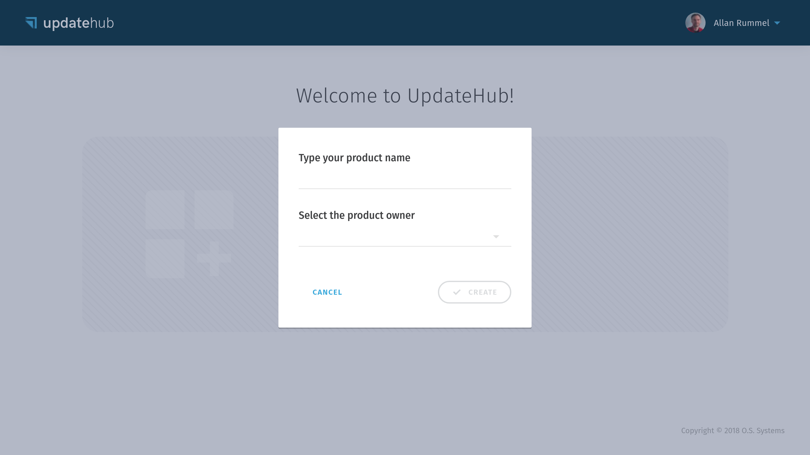
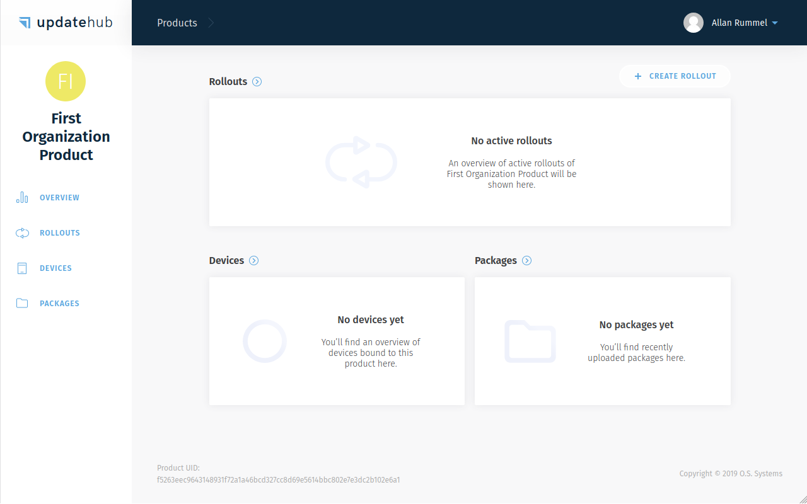
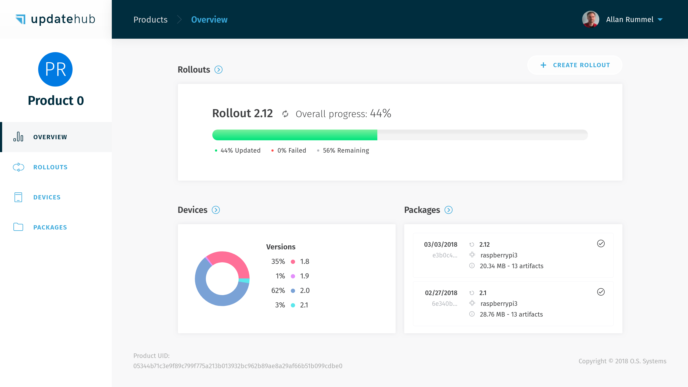

# Managing a Product

A *Product* creation is the first step we need to do when starting to use the **UpdateHub Cloud**. It is required because every *Device*, *Package* or *Rollout* needs to be associated with a *Product*.

In this session we will cover:

- [How to create a product](#how-to-create-a-product)
- [Viewing the details of a product](#viewing-the-details-of-a-product)

## How to create a Product

To create a *Product* just go to *Add product* through the initial page of the *Dashboard*.

!!! info ""
    When you access the Dashboard home page, all of your created *Products* will be displayed.

  

By doing that the following dialog will be displayed.

  

Please choose a *Product* name and its *Owner* (*Me* or an [*Organization*](../menu/#organization)). Every organization that the user has access to is available as the *Owner* of the *Product*. Bear in mind that an *Organization* is a group of users and that it may own one or more *Product*.

Users who belong to an organization may have different access levels to a given *Product*.

!!! danger "About the name and owner"
    Pay attention that after you create a *Product* you can not rename or delete it, and you can not transfer it to an organization or vice versa, so be sure you are choosing the correct name and the owner.

  

After the *Product* has been created a *Unique Identifier Number* \(*UPDATEHUB_PRODUCT_UID*\) is generated to identify it. This number should be added to your build to allow the **UpdateHub Agent**, which runs inside the target *Device*, to communicate with the **UpdateHub Cloud**.

For convenience, you can add the *UPDATEHUB_PRODUCT_UID* to your  *build/conf/local.conf* configuration file when prototyping.

!!! warning ""
    As this is information that will be permanent for the whole *Product* life cycle, it should be put inside your distribution configuration file or image recipe.

After you press the *OK* button you will be into the *Products* screen where you can see all your *Product*, *Rollouts*, *Devices*, and *Packages*.

  

If you make changes in your *Product* and send these changes to your **UpdateHub** the *Package* will appear in the *Package List*.

## Viewing the details of a Product

When you access the *Dashboard*, the *Products* you have created or have access to are displayed in a list. The page appears as shown below:

  

Clicking on any *Product* card, you will be taken to the *Product Overview* page. On this page you find useful information about the *Product*, as which *Devices* you have deployed on the field, the two last *Packages* sent for that particular *Product* and the *Rollouts* status.

  

!!! info ""
    In case you didn't copy the *Product Unique Identifier Number* the moment that you create it on the **UpdateHub Cloud**, don't worry. To get access to this information again you must click on the *Product* icon and the *Unique Identifier Number* will be shown to you.
